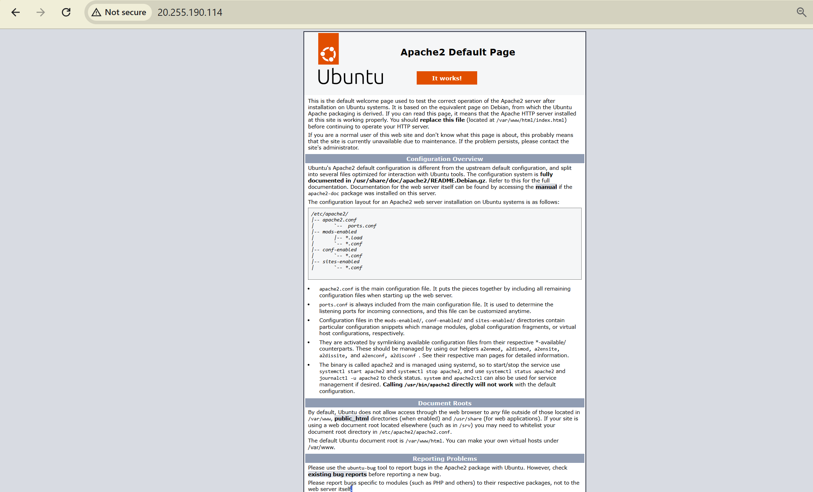

<h1><u>* Azure VM High Availability Infrastructure *</u></h1>

<u>This project demonstrates the deployment of a secure and highly available Linux VM infrastructure on Microsoft Azure. It includes:</u>

- Azure Virtual Network (VNet)
- Network Security Group (NSG)
- Two Ubuntu Linux Virtual Machines
- Azure Load Balancer for high availability
- Azure Bastion for secure SSH access
- Apache Web Server setup on each VM

---

<h3>* Tools & Services Used * </h3>

- Microsoft Azure Portal
- Ubuntu Linux
- Apache2
- NSG (Network Security Group)
- Azure Load Balancer
- Azure Bastion
- Azure Resource Group

---

* Features *

- Secure SSH via Bastion (no public IPs)
- HTTP access via Load Balancer
- NSG configured with least required rules
- Cost-effective Standard SSD disks
- Manual deployment for learning and control

---

* What I Learned *

- How to securely deploy Linux VMs with restricted access
- Basics of Azure networking and subnet configuration
- How to use Bastion for secure, browser-based SSH
- Creating a public load balancer with backend pools and health probes

---

