<h2><u>* Step-by-Step Setup – Azure VM High Availability Project * </u></h2>

---

<h3>1. Create Resource Group </h3>
- Name: "rg-ruchika-vm-lab"
- Region: East Asia

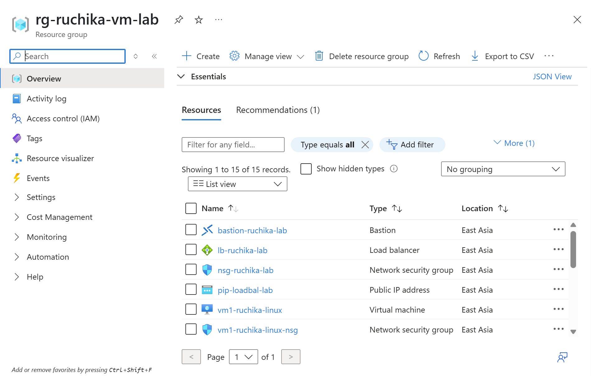

---

<h3>* 2. Create Virtual Network *</h3>
- Name: "vnet-ruchika-lab"
- Address space: "10.0.0.0/16"
- Subnet: "subnet-ruchika-lab" → "10.0.1.0/24"

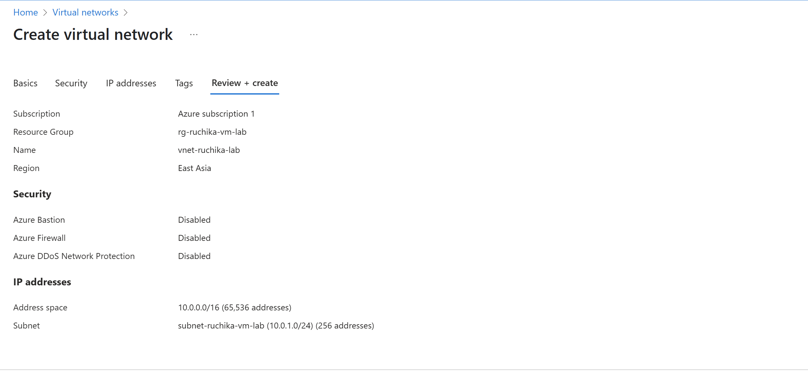
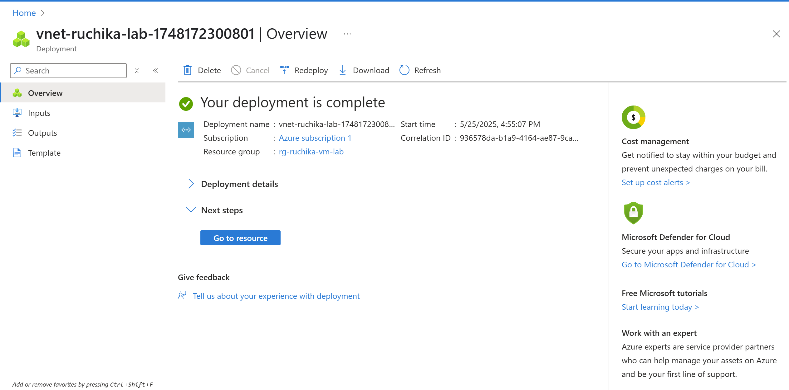

---

<h3>* 3. Create Network Security Group *</h3>
- Name: "nsg-ruchika-lab"
- Inbound Rules:
  - Allow SSH (22) from any
  - Allow HTTP (80) from any

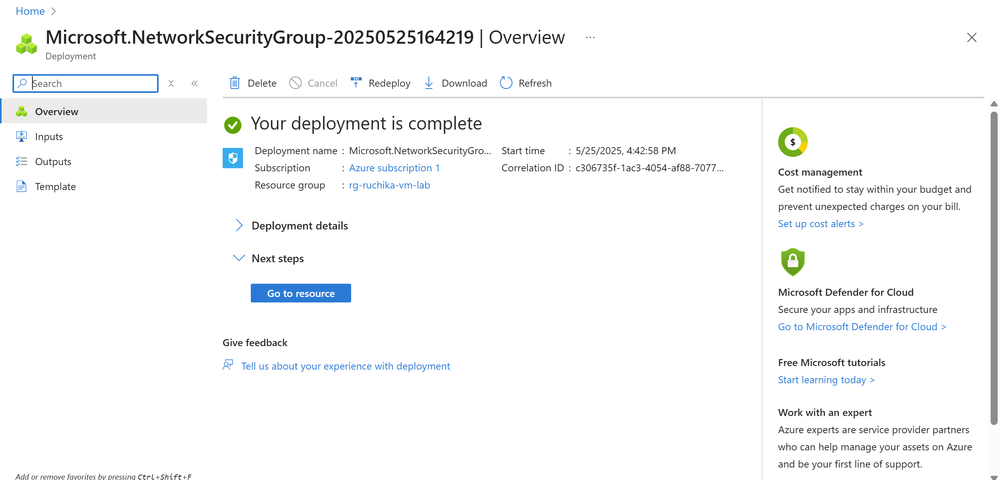
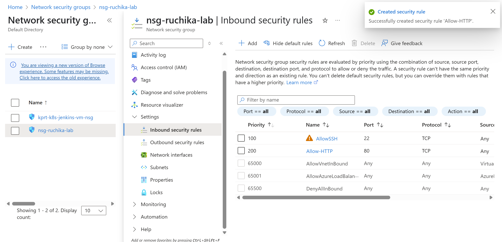

---

<h3>* 4. Create Two Linux VMs (Ubuntu 20.04 LTS) *</h3>
- No Public IPs
- Attach to "subnet-ruchika-lab" and "nsg-ruchika-lab"
- Standard SSD, B1s/D2as_v5 VM size
- Installed Apache using:
- bash
sudo apt update
sudo apt install apache2 -y
sudo apt start apache2

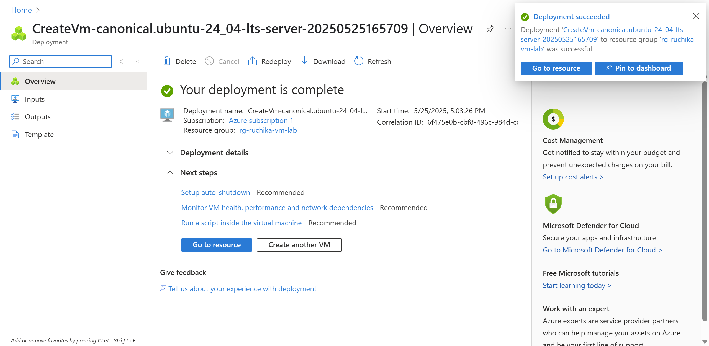
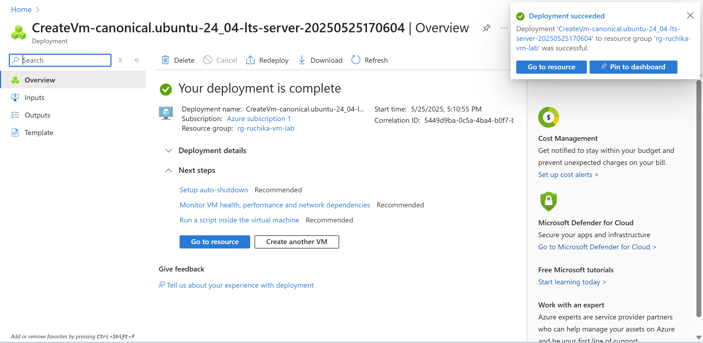

---

<h3>* 5. Create Public Load Balancer *</h3>
- Name: "lb-ruchika-lab"
- Frontend IP: new public IP
- Backend Pool: Add both VMs
- Health Probe: HTTP, Port 80
- Rule: Forward Port 80 to backend

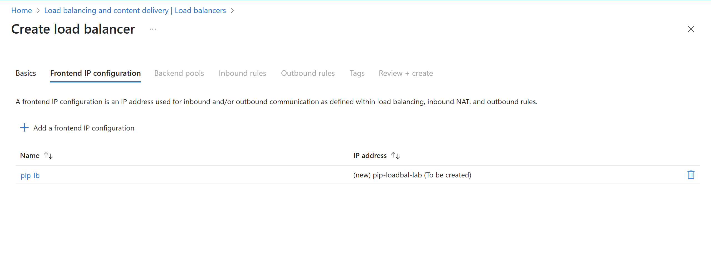
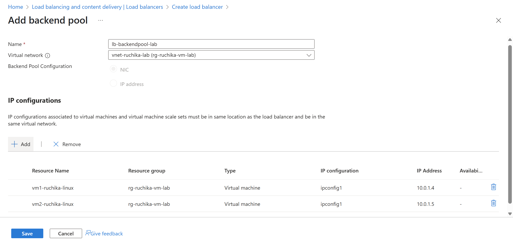

---

<h3>* 6. Set Up Azure Bastion *</h3>
- Create subnet: AzureBastionSubnet → 10.0.255.0/26
- Deploy Azure Bastion
- SSH into VMs using Bastion in portal

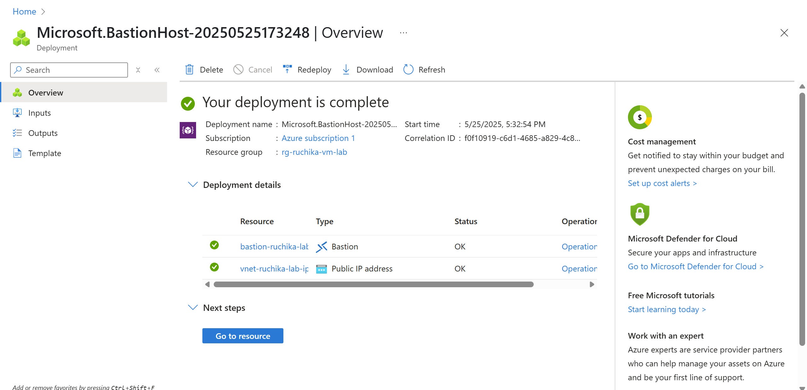

---

<h3>* 7. Test Load Balancer *</h3>
- Visit Load Balancer public IP in browser "20.255.190.114"
- Apache homepage appears

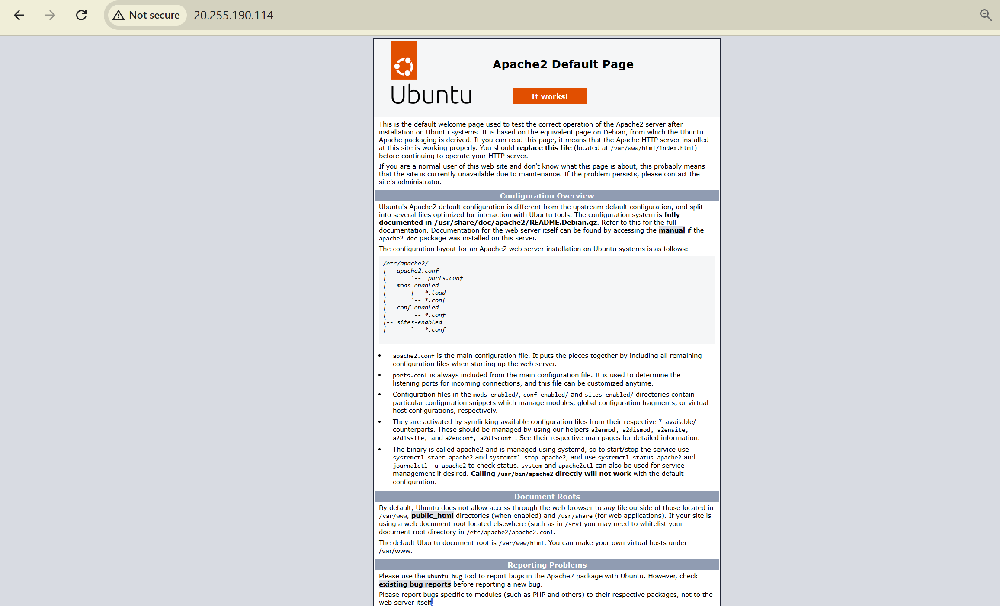

---
